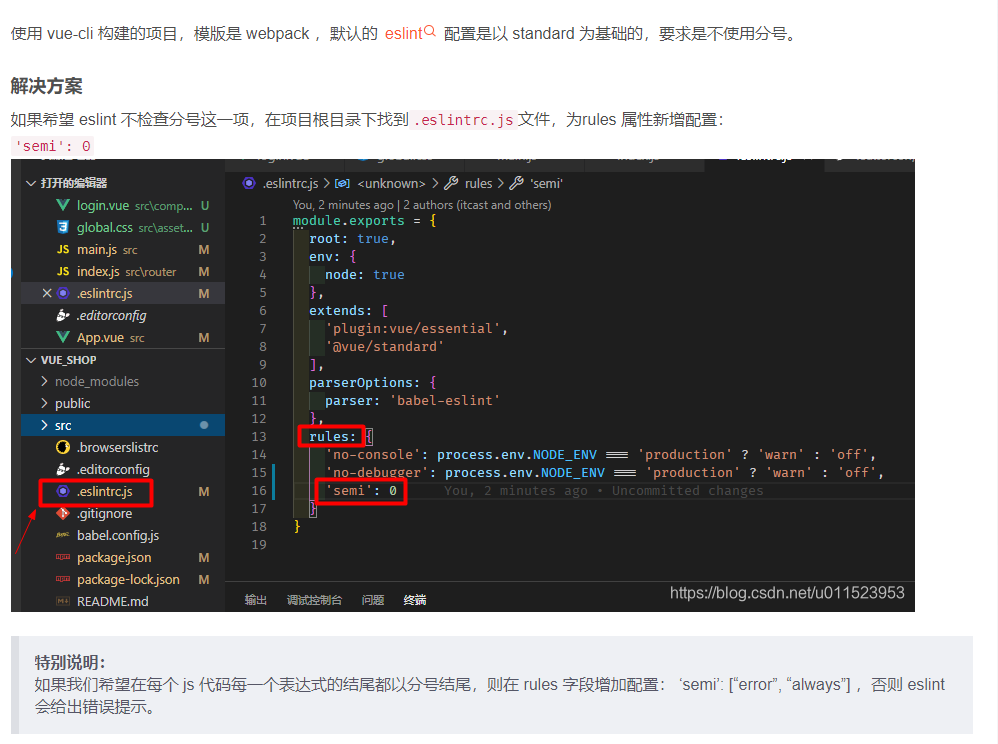
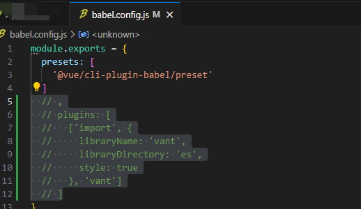
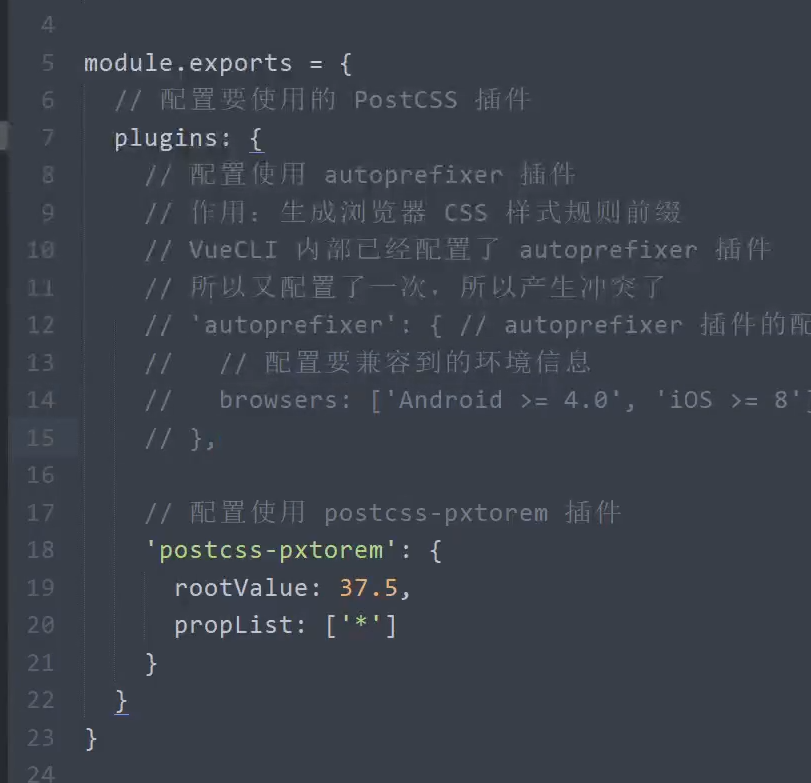

## 使用Vue CLI 创建项目

```shell
//安装vueCLI包
npm install --global @vue/cli@4.2.3 // npm i -g @vue/cli@4.2.3
 npm i -g @vue/cli@4.5.12

//创建Vue项目  空格键是勾选  enter键是确定下一步
vue create toutiao-m
//选择manually 手动选择特性
//default:默认勾选babel(es6代码转换为es5代码兼容低版本浏览器)和eslint 回车之后直接进入装包
//manually:自定义勾选特性配置,选择完毕后,才会进入装包
//vueCLI版本查看C:\Users\JiKeHuang\AppData\Roaming\npm
*Babel es6代码转es5代码兼容低版本浏览器
*Router 就是vue-router管理项目中的路由
*Vuex 管理项目中的共享数据状态的
*CSS Pre-processors css预处理器
*Linter/Formatter 规范代码格式

Use history mode for router? n
*Less
*ESLint+Standard config
*Lint on save
*Lint and fix on commit
*In dedicated config files

Save this as a preset for future projects?
是否保存这些配置项目,未来的创建项目也使用这些配置 *n

```

## git提交

```tex
 gitee.com 
 oldhuang
 999999hH^
 -------------------------
 yaoyh
 999999hH^
 ---------------------------
 yaoyh2023
 999999hH^
 
 
 yiyayo1234@gmail.com
 999999hH^
 
```


```bash
git remote add origin 仓库地址//git remote add 远程地址的别名(如origin) 远程仓库地址

//git remote add 添加到远程仓库https://github.com/oldhuang11/toutiao-m.git 命名为origin 
git remote add origin https://github.com/oldhuang11/toutiao-m.git
//git remote -v 
//第一次push git还不知道要把代码推送到哪里 
//声明式指定git推送到叫origin的远程仓库https://github.com/oldhuang11/toutiao-m.git
,然后将本地master分支的代码推送到远程仓库的master分支
 全写 git push --set-upstream origin master:master
简写 git push --set-upstream origin master
每个新分支只需要执行一次git push --set-upstream origin 本地分支:远程分支,下一次只需要git push 就可以了 


```

### 问题

1. git push --set-upstream origin master
   remote: Permission to oldhuang11/toutiao-m.git denied to ohuang40.
   fatal: unable to access 'https://github.com/oldhuang11/toutiao-m.git/': The requ
   ested URL returned error: 403

   控制面板-所有控制面板项-凭证管理器>Windows凭据-普通凭据-编辑

   还有就是网络问题,需要科学上网解决.还有就是凭证的账号跟git的账号不一致.

2.  error  in ./src/main.js

   Module Error (from ./node_modules/eslint-loader/index.js):

   C:\Users\JiKeHuang\Documents\vue-projects\code\toutiao-m\src\main.js
     8:14  error  Extra semicolon  semi

   ✖ 1 problem (1 error, 0 warnings)
     1 error and 0 warnings potentially fixable with the `--fix` option.

   解决,提示不要有分号.检查代码把分号删除

   

3.   启动vue,报错Vant is not defined

   配置按需引入后，将不允许直接导入所有组件。如果使用了导入所有vant组件的方式,不要配置按需导入的配置,否则启动会报错Vant is not defined,所以要注释掉

   

4. Error: PostCSS plugin postcss-pxtorem requires PostCSS 8

   这里报错 postcss-pxtorem 需要 8. 我以为要使用postcss-pxtorem 8.以上的版本就去看了一下postcss-pxtorem版本最高才6.0,

   这里降低 postcss-pxtorem@5.1.1

   插件的版本适配问题,版本设置为v5的版本就可以了

   yarn add postcss-pxtorem@5.1.1

   npm i postcss-pxtorem@5.1.1
   
5. 提交问题  解决pre-commit hook failed (add --no-verify to bypass)的问题

   解决 $ git commit --no-verify  -m "字体图标和图片素材"

   #### 问题原因：

   　　**pre-commit钩子惹的祸**

   　　当你在终端输入git commit -m"XXX",提交代码的时候，
   　　pre-commit(客户端)钩子，它会在Git键入提交信息前运行做代码风格检查。
   　　如果代码不符合相应规则，则报错。

    

   **解决方式：**

   #### 一、 简单粗暴的方式

   1. 进入项目的.git文件夹下面hooks文件夹，手动删除pre-commit文件
   2. 运行命令：rm -rf ./git/hooks/pre-commit 删除pre-commit文件

   #### 二、 根据提示在命令中添加--no-verify

   　　将git commit -m"XXX" 改为 git commit --no-verify –m"XXX"

   

   #### 三、 代码改到符合标准再提交（推荐使用这个）

   

## vant组件库(黑马头条项目用的是vant@2.5.7)

轻量可靠的移动端Vue组件库

官网 

https://vant-ui.github.io/vant/#/zh-CN

github.com/youzan/vant

vant v2版本文档

 https://vant-ui.github.io/vant/v2/#/zh-CN/

https://www.bookstack.cn/read/vant-2.4/89ca394cd418f574.md

```shell
//安装vant
//①npm安装
npm i vant@2.5.7 -S
//②yarn安装
yarn add vant@2.5.7
```


```shell
//引入vant组件
//方式一 自动按需引入组件(推荐)
//先安装babel插件
npm i babel-plugin-import -D
yarn add babel-plugin-import -D

# Vue 2 项目，安装 Vant 2：
npm i vant@latest-v2 -S

// 在.babelrc 中添加配置
// 注意：webpack 1 无需设置 libraryDirectory
{
  "plugins": [
    ["import", {
      "libraryName": "vant",
      "libraryDirectory": "es",
      "style": true
    }]
  ]
}

// 对于使用 babel7 的用户，可以在 babel.config.js 中配置
module.exports = {
  plugins: [
    ['import', {
      libraryName: 'vant',
      libraryDirectory: 'es',
      style: true
    }, 'vant']
  ]
};


方式三. 导入所有组件
import Vue from 'vue';
import Vant from 'vant';
import 'vant/lib/index.css';

Vue.use(Vant);
```


## 移动端REM适配

Vant中的样式默认使用px作为单位,如果要使用rem单位,推荐两个工具

1. postcss-pxtorem 是一款postcss插件,用于将单位转行为rem
2. lib-flexible用于设置rem的基准值

### 使用lib-flexible动态设置REM基准值(html标签的字体大小)

```shell
#安装
#yarn add amfe-flexible
npm i amfe-flexible

#然后在main.js中加载该模块
import 'amfe-flexible'
#设置后要手动yarn serve重启才会生效
#然后改变模拟手机的尺寸,看看html标签的font-size会不会适配不同的尺寸,如果会适配,就是安装和配置成功了
#lib-flexible是宽度分成10份,设置基准值为宽度的十分之一,比如设备宽度是320px,lib-flexible就会设置基准值为32px
```

### 使用postcss-pxtorem将px转为rem

```shell
#参考https://vant-ui.github.io/vant/v2/#/zh-CN/advanced-usage
#安装 -D 是--save-dev的简写  开发使用过程中使用的工具 生产上线就不需要了
#yarn add -D postcss-pxtorem
npm i postcss-pxtorem -D
#在项目根目录中创建 .postcssrc.js文件 配置
// postcss.config.js
// postcss.config.js
module.exports = {
    plugins: {
        autoprefixer:{
            browsers:['Android >= 4.0','IOS >= 8']
        },
      // postcss-pxtorem 插件的版本需要 >= 5.0.0
      'postcss-pxtorem': {
        rootValue({ file }) {
          return file.indexOf('vant') !== -1 ? 37.5 : 75
        },
        propList: ['*'],
      },
    },
  };
 #如果出现问题,查看问题解决方法
 #行内样式是不会转换的,所以要自己写为rem单位
 #该插件不能转换行内样式中的px,例如<div style="width:200px"></div>
```


### PostCSS介绍

PostCSS是一个处理CSS的处理工具,本身功能比较单一,它主要负责解析CSS代码,再交由插件进行处理,它的插件体系非常强大,所能进行的操作是多种多样的,例如:

Autoprefixer插件可以实现自动添加浏览器相关声明前缀

PostCSS Preset Env 插件可以让你使用更新的CSS语法特性实现向下兼容

postcss-pxtorem可以实现将px转换为rem

目前PostCSS已经有200多个功能各异的插件

PostCSS一般不单独使用,而是与已有的构建工具进行集成

Vue CLI默认集成了PostCSS,并且默认开启了autoprefixer插件

```shell
Vue CLI内部使用了PostCSS 可以通过.postcssrc 或者 postcss-load-config支持的配置PostCSS.也可以通过vue.config.js中的css.loaderOptions.postcss配置postcss-loader
我们默认开启了autoprefixer 如果要配置目标浏览器,可以使用package.json的browserslist字段
autoprefixer插件的配置

module.exports={
	//作用 生成浏览器CSS样式规则前缀
	autoprefixer:{
		//配置要兼容到的环境信息
		browsers:['Android >= 4.0','IOS >= 8']
	}
}
```




## 封装请求模块

### 安装axios

```bash
#安装axios
#yarn add axios
npm i axios
```

### 创建 项目根目录/src/utils/request.js

```js
#封装axios亲求模块
import axios from 'axios'

const request = axios.create({
    baseURL:"http://ttapi.research.itcast.cn/"
})
#导出
export default request

#使用
#方式一 请求对象挂载到Vue.prototype原型对象中,然后在组件中通过this.xxx直接访问,简单方便,但是不利于接口维护
#方式二 把每一个请求都封装成每一个独立的功能函数,在需要加载调用,这种做法更便于接口管理和维护

```


## 导入图标素材

图片图标 放大图标会模糊 请求图片资源需要请求服务器资源,图片请求太多,服务器响应会受到影响,响应速度变慢

一般由设计师提供矢量图标svg格式图标,转换为字符图标,字体图标只需要加载一次就可以,放大也不会模糊

iconfont制作字体图标 svg文件转字体图标

iconfont.cn 

根目录/src/styles 新建 index.less和icon.less

main.js文件配置加载全局样式

```js
import '@/styles/index.less'
```

index.less

```less
//加载全局样式文件

//加载图标样式
@import "./icon.less"
```


使用字体图标

```html
<div>
    <i class="icon toutiao toutiao-dianzan"></i>
</div>
```


素材图片放到 assets文件夹

网页title图标(favicon.ico)放在public文件夹


REM适配?

Less是什么

history mode和hash mode是什么

## 第二天
##登录页路由配置
views/Login/index.vue
```shell
  
```